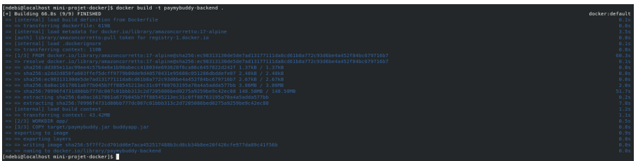
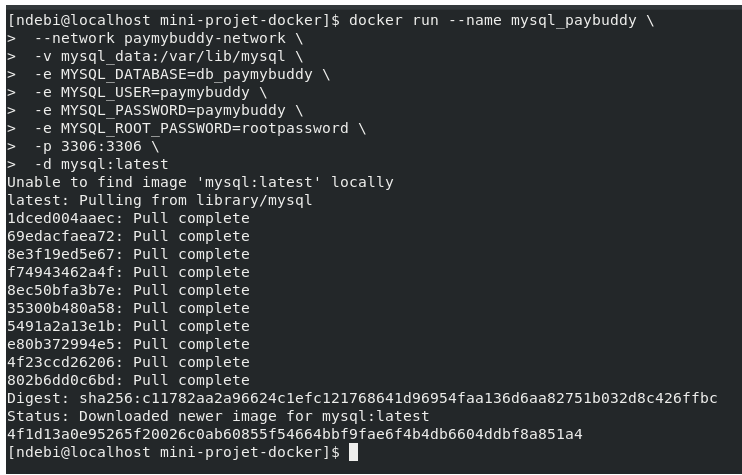
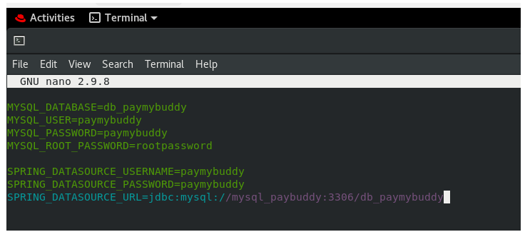
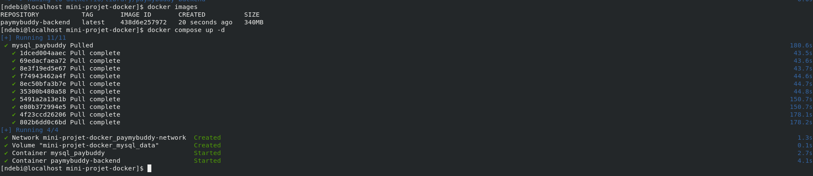
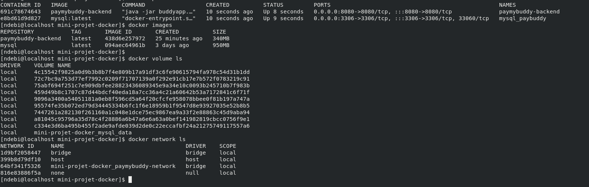
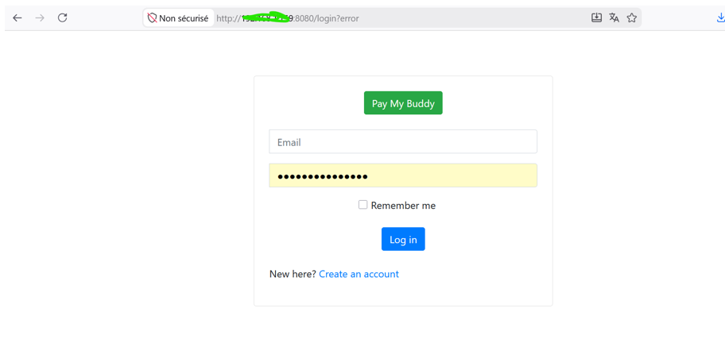
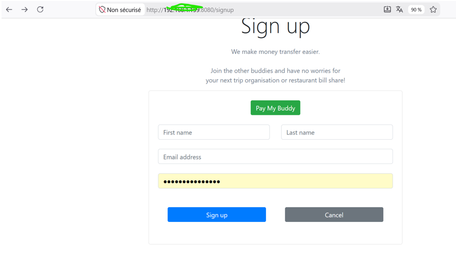
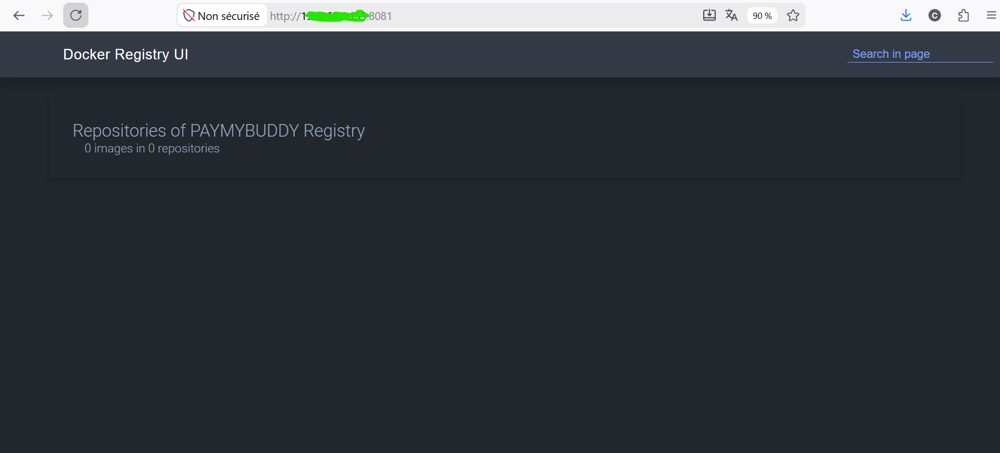
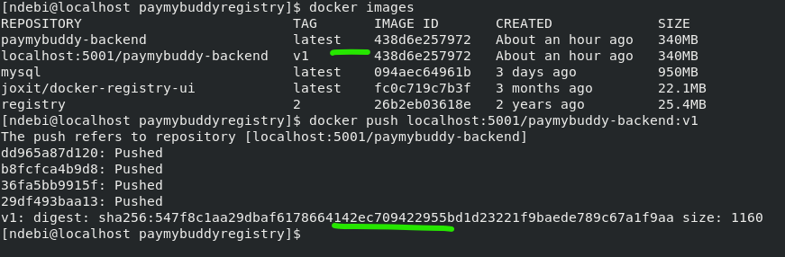

# Projet de Déploiement Docker PayMyBuddy

## Présentation du Projet

Ce projet démontre le déploiement de l’application PayMyBuddy à l’aide des technologies Docker et des principes d’Infrastructure as Code (IaC).

L’objectif principal de cette preuve de concept (POC) est de :

- Conteneuriser le backend Spring Boot
- Déployer une base de données MySQL dans un conteneur Docker
- Orchestrer les services avec Docker Compose
- Sécuriser les informations sensibles avec des variables d’environnement
- Mettre en place un stockage persistant avec Docker Volumes
- Déployer un registre Docker privé
- Pousser les images Docker vers le registre privé
- Vérifier le bon fonctionnement de l’application depuis le navigateur

---

# Technologies Utilisées

- Docker
- Docker Compose
- Spring Boot
- MySQL
- Maven
- Amazon Corretto 17 Alpine
- Docker Registry
- Docker Registry UI
- Git & GitHub

---

# Architecture du Projet

L’infrastructure est composée des services suivants :

- Backend Spring Boot
- Base de données MySQL
- Orchestration Docker Compose
- Registre Docker privé
- Interface graphique du registre Docker

---

# Conteneurisation du Backend

Le backend Spring Boot a été conteneurisé à l’aide d’un Dockerfile basé sur l’image Amazon Corretto 17 Alpine.

## Dockerfile du Backend

```Dockerfile
FROM amazoncorretto:17-alpine

LABEL maintainer="ndoumbendebi@gmail.com" \
      description="PayMyBuddy Backend"

WORKDIR /app

COPY target/paymybuddy.jar buddyapp.jar

EXPOSE 8080

CMD ["java", "-jar", "buddyapp.jar"]
```

## Construction de l’Image Docker

```bash
docker build -t paymybuddy-backend .
```

## Vérification du Build de l’Image



---

# Déploiement de la Base de Données MySQL

La base de données MySQL a été déployée dans un conteneur Docker avec stockage persistant.

## Commande de Déploiement MySQL

```bash
docker run --name mysql_paybuddy \
  --network paymybuddy-network \
  -v mysql_data:/var/lib/mysql \
  -e MYSQL_DATABASE=db_paymybuddy \
  -e MYSQL_USER=paymybuddy \
  -e MYSQL_PASSWORD=paymybuddy \
  -e MYSQL_ROOT_PASSWORD=rootpassword \
  -p 3306:3306 \
  -d mysql:latest
```

## Vérification du Déploiement MySQL



---

# Initialisation de la Base de Données

Le schéma de la base de données a été initialisé automatiquement grâce au dossier `initdb`.

## Fichier SQL d’Initialisation

```text
initdb/create.sql
```

Les scripts SQL sont exécutés automatiquement au démarrage du conteneur MySQL.

## Vérification de l’Initialisation


---

# Gestion des Variables d’Environnement

Les informations sensibles ont été externalisées à l’aide d’un fichier `.env` afin d’éviter le hardcoding des identifiants dans le Dockerfile.

## Exemple du Fichier .env

```properties
MYSQL_DATABASE=db_paymybuddy
MYSQL_USER=paymybuddy
MYSQL_PASSWORD=yourpassword
MYSQL_ROOT_PASSWORD=yourrootpassword

SPRING_DATASOURCE_USERNAME=paymybuddy
SPRING_DATASOURCE_PASSWORD=yourpassword
SPRING_DATASOURCE_URL=jdbc:mysql://mysql_paybuddy:3306/db_paymybuddy?allowPublicKeyRetrieval=true&useSSL=false
```

## Création du Fichier .env



---

# Orchestration avec Docker Compose

L’infrastructure complète a été déployée à l’aide de Docker Compose.

## docker-compose.yml

```yaml
services:

  paymybuddy-backend:
    image: paymybuddy-backend
    container_name: paymybuddy-backend

    depends_on:
      - mysql_paybuddy

    env_file:
      - .env

    ports:
      - "8080:8080"

    networks:
      - paymybuddy-network

  mysql_paybuddy:
    image: mysql:latest
    container_name: mysql_paybuddy

    volumes:
      - mysql_data:/var/lib/mysql
      - ./initdb:/docker-entrypoint-initdb.d

    env_file:
      - .env

    ports:
      - "3306:3306"

    networks:
      - paymybuddy-network

volumes:
  mysql_data:

networks:
  paymybuddy-network:
```

## Déploiement de l’Infrastructure

```bash
docker compose up -d
```

## Vérification du Déploiement Docker Compose



## Vérification de l’Infrastructure



---

# Test de l’Application

L’application a été testée directement depuis le navigateur après le déploiement.

## Accès à l’Application

```text
http://IP_VM:8080
```

## Vérification Depuis le Navigateur



## Vérification de la Page de Création de Compte



---

# Déploiement du Registre Docker Privé

Un registre Docker privé a été déployé avec Docker Compose.

## docker-compose.yml du Registre

```yaml
services:

  registry:
    image: registry:2
    container_name: private-registry

    ports:
      - "5001:5000"

    volumes:
      - registry-data:/var/lib/registry

    networks:
      - registry-network

  registry-ui:
    image: joxit/docker-registry-ui:latest
    container_name: registry-ui

    environment:
      REGISTRY_TITLE: "PAYMYBUDDY Registry"
      SINGLE_REGISTRY: "true"
      DELETE_IMAGES: "true"
      NGINX_PROXY_PASS_URL: http://registry:5000

    ports:
      - "8081:80"

    networks:
      - registry-network

volumes:
  registry-data:

networks:
  registry-network:
```

## Déploiement du Registre


## Vérification de l’Interface du Registre



---

# Tag et Push des Images Docker

L’image du backend a été taggée puis poussée vers le registre Docker privé.

## Commande Docker Tag

```bash
docker tag paymybuddy-backend \
localhost:5001/paymybuddy-backend:v1
```

## Commande Docker Push

```bash
docker push localhost:5001/paymybuddy-backend:v1
```

## Vérification du Push de l’Image



---

# Vérification des Conteneurs Docker

Les différents conteneurs déployés ont été vérifiés à l’aide des commandes Docker.

## Vérification des Conteneurs

```bash
docker ps
```

## Vérification Backend et MySQL


## Vérification des Conteneurs du Registre


---

# Leçons Apprises

Au cours de ce projet nous avons appris :

- La création d’images Docker
- La conteneurisation d’une application Spring Boot
- Le déploiement d’une base de données MySQL
- La gestion des réseaux Docker
- La persistance des données avec Docker Volumes
- La gestion des variables d’environnement avec `.env`
- L’orchestration avec Docker Compose
- Les principes d’Infrastructure as Code
- Le déploiement d’un registre Docker privé
- Le versionnement et le push d’images Docker
- Le debugging et l’analyse des logs Docker

---

# Conclusion

Ce projet a permis de démontrer le déploiement complet d’une application multi-services à l’aide des technologies Docker.

Le backend PayMyBuddy ainsi que la base de données MySQL ont été conteneurisés puis orchestrés avec Docker Compose. Les informations sensibles ont été sécurisées grâce aux variables d’environnement et les images Docker ont été stockées dans un registre Docker privé.

Ce projet nous a également permis d’acquérir une expérience pratique sur l’Infrastructure as Code, les réseaux Docker, les volumes persistants et l’orchestration de cont
